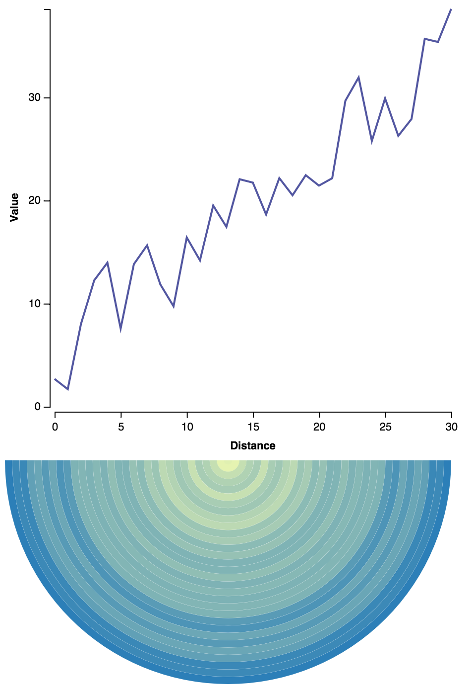
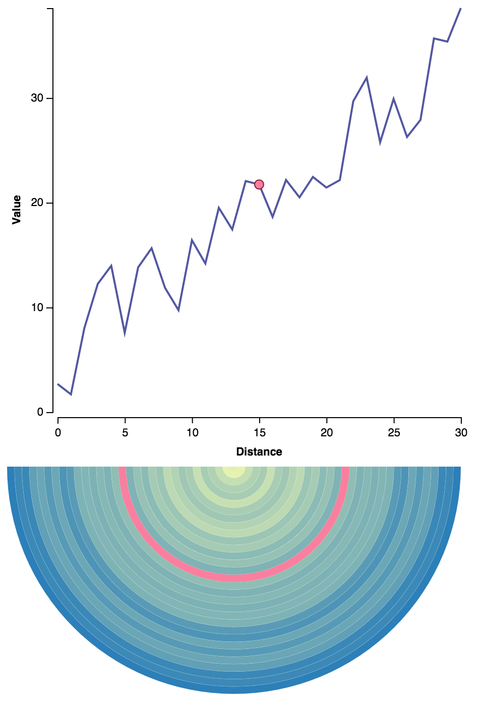

# linked-highlighting-react-vega-redux
An example of doing linked highlighting between separate visualization components using [React](https://facebook.github.io/react/), [Vega](http://vega.github.io/), and [Redux](http://rackt.org/redux/). The original structure and code for the server comes from [Redux examples](https://github.com/rackt/redux/tree/master/examples/todomvc).

A line chart and a radial heatmap are drawn, rendering the same set of data. When the user mouses over either chart, highlighting marks are drawn on both charts. See [linked-highlighting-react-d3-reflux](https://github.com/pbeshai/linked-highlighting-react-d3-reflux) for a similar example using React, [D3](http://d3js.org/), and [Reflux](https://github.com/reflux/refluxjs).

**Demo**: http://pbeshai.github.io/linked-highlighting-react-vega-redux/



*Charts with no highlighting*



*Charts with linked highlighting on mouse over*

# Installation
Install npm packages:
```
npm install
```

## Error installing vega's npm package
If you had an error installing vega's npm package involving missing pkg-config or some other error installing canvas, here are the steps I did to fix them using [Homebrew](http://brew.sh/):

```
brew update
brew install cask
brew install Caskroom/cask/xquartz
brew install cairo
```

Then I set my `PKG_CONFIG_PATH` environment variable to `/opt/X11/lib/pkgconfig`.

Alternative instructions: https://github.com/Automattic/node-canvas/wiki/Installation---OSX

# Usage
Start the server:
```
npm start
```

Note the server uses webpack's hot reloading feature, which allows you to see changes you make to javascript automatically, without having to do a full page refresh.

## Build
To build the production files:
```
npm run build
```

# Author
Peter Beshai [@pbesh](http://twitter.com/pbesh)

